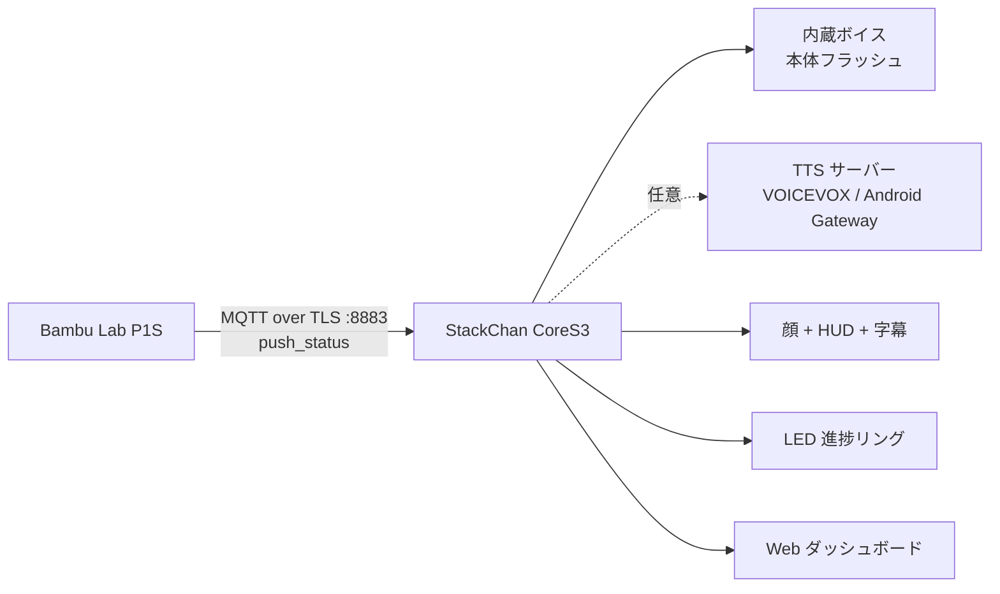

# StackChan × Bambu Lab 実況モニター

M5Stack StackChan（K151 / CoreS3）が **Bambu Lab P1S の印刷をリアルタイムで見守り、
声と表情で実況する** PlatformIO / Arduino プロジェクトです。

- ベース: [Xenoah/stackchan-codex](https://github.com/Xenoah/stackchan-codex) v1.1.5
  （アバター・リップシンク・TTS・設定ポータル・キャリブレーション）
- プリンタ通信: [Xenoah/ESP32-bambu-MQTT](https://github.com/Xenoah/ESP32-bambu-MQTT)
  の Bambu Lab LAN MQTT 実装を StackChan 向けに再構成

**現在のリリース: [v2.4.1](https://github.com/Xenoah/stackchan-mqtt/releases/tag/v2.4.1)（プレリリース）**

v2.4.1では、プリンター接続後に首が急に左へ回る不具合を修正しました。
通常のファーム更新で適用でき、音声パックの書込みや再キャリブレーションは不要です。



> [!NOTE]
> **内蔵ボイス**（VOICEVOX で作ったずんだもんの声を本体に焼き込んだもの）があれば、
> PC やスマホの TTS サーバーなしで StackChan 単体で実況します。実況の決まり文句は録音どおりの
> 自然な声で、それ以外の**日本語・英語の自由文も**本体の読み辞書で読んでモーラ（1拍の音）を
> つなげて喋ります。TTS サーバーを使う場合も、サーバーにつながらないときは自動で内蔵ボイスに切り替わります。
> StackChan とプリンターは同じ LAN にある必要があります。

## できること

### モード（印刷が始まると自動で MQTT モード）

| モード | 顔 | 頭頂タップ | 実況 |
|---|---|---|---|
| **MQTT**（プリンター実況） | プリンター詳細画面（タップで HUD 付きの顔） | いまの状況を報告 | すべて喋る |
| **LOCAL LLM**（通常） | 顔だけ | 設定した文章を話す | 開始・進捗・完了・エラーなど大事なものだけ（工程・温度・定期報告は Web のログのみ） |
| **LEVEL HOLD** | 顔だけ | 設定した文章を話す | LOCAL LLM と同じ |

- 起動直後は LOCAL LLM。プリンターが**準備・印刷・一時停止**に入ると自動で MQTT モードへ切り替わって
  プリンター詳細画面を出し（顔より画面を優先）、印刷が終わって 5 分たつと元のモードと顔に戻ります
  （LED の完了表示と同じ長さ）。詳細画面をタップすると HUD 付きの顔になります。
- プリンターの監視を設定していないと自動では切り替わりません（メニュー → 設定 → プリンター）。
- 印刷中にメニューや Web で別のモードを選ぶと、そのジョブの間は自動で MQTT モードに戻しません。
- 自動切り替えは設定画面の「印刷が始まったら自動で MQTT モードにする」で OFF にできます。
  OFF のときはメニューの「MQTT」または Web ダッシュボードのボタンで切り替えます。

### 実況（スタックチャンが喋る）

プリンターの状態が変わるたびに、日本語で実況します（セリフは複数パターンからランダム）。

| タイミング | 例 |
|---|---|
| 接続・起動時 | 「プリンターとつながったよ！いま「Cube」を印刷中で、45%まで進んでる。」 |
| 準備開始 | 「印刷の準備を始めたよ！「Benchy」を作るみたい」 |
| 準備工程 | 「ベッドのレベリング中。ていねいに測ってるよ」「ノズルの先をお掃除中」 |
| 目標温度到達 | 「ノズルが220度になったよ。準備オーケー」 |
| 印刷開始 | 「印刷スタート！全部で250層、だいたい1時間23分かかる予定だよ。終わるのは15時42分ごろ」 |
| 1層目完了 | 「1層目が終わったよ！ここを越えればひと安心」 |
| 進捗（既定 10% ごと） | 「半分まで来たよ！残りは42分くらい」 |
| 残り10分・最終層 | 「あと10分くらいで完成だよ！」「最後の層に入ったよ！」 |
| フィラメント切替 | 「白のPLAに切り替えたよ」（AMS の色名を自動判定） |
| 一時停止 | 「印刷が一時停止したよ。フィラメント切れで止まったみたい。確認してね」 |
| 完了 | 「印刷完了！「Cube」ができたよ。かかった時間は1時間25分。おつかれさま！」＋首振りで喜ぶ |
| 失敗・キャンセル | 「あっ、印刷が止まっちゃった…」／「印刷がキャンセルされたよ」 |
| HMS エラー | 「プリンターからお知らせが1件あるよ。画面を確認してね」 |
| 接続断・設定ミス | 「アクセスコードが違うみたい。プリンターの画面で確認してね」 |
| 無言が続いたとき（既定 15 分） | 「いま62%、180層目。全部で250層だよ」 |
| 頭をタップ | いまの状況をまとめて報告 |

- 表情も連動します（完了＝喜び、一時停止＝疑い、失敗＝悲しみ、エラー＝怒り）。
- 実況の声は Web またはメニューからいつでも ON/OFF できます（OFF でも字幕と表情は出ます）。
- 夜間モード（既定 23時〜7時）は、完了・失敗・一時停止・エラーと、頭タップなどの直接の問いかけだけを声に出し、ほかは字幕だけにします。
- 同じ工程は1ジョブ1回、多色印刷のフィラメント切替は10分に1回までに抑え、うるさくならないようにしています。
- 完了・失敗・エラーなど重要な実況は、待っている軽い実況より優先されます。

### 画面・LED

| 表示 | 内容 |
|---|---|
| **顔 + HUD** | 顔の上部に状態チップ・進捗 %・残り時間・進捗バー、下部にレイヤー・温度・ジョブ名・完成予定。実況中は下部が**字幕**になります |
| **プリンター詳細画面** | 顔をタップすると開くフルカラー画面。進捗リング、残り・完成予定、レイヤー、工程、ノズル/ベッド温度、AMS の色、最新の実況 |
| **LED 進捗リング** | 印刷中は左右6灯ずつで進捗を表示（端数の1灯がゆっくり脈打つ）。準備中＝青の呼吸、一時停止＝黄色点滅、完了＝緑、失敗＝赤点滅 |
| **メニュー** | 画面下端から上スワイプ。1段目がモード（MQTT / LOCAL LLM / LEVEL HOLD）、2段目がプリンター詳細 / 実況の声 / 設定、下に閉じる |
| **本体で設定** | メニュー → 設定 から Wi-Fi・プリンター（MQTT）・接続情報を選び、画面のキーボードで設定できます（下記） |

HUD は m5avatar の顔スプライトの中に描いているため、顔のアニメーションと同じフレームで
ちらつかずに表示されます（各顔テンプレートの「口」パーツを包む Drawable として差し込み）。

### Web ダッシュボード

ブラウザで `http://<StackChan の IP>/` を開くと、スマホ向けのダッシュボードが表示されます。

- 進捗リング、残り時間・完成予定、レイヤー、工程、速度モード
- ノズル / ベッド / チャンバー温度、ファン
- AMS トレイの色・材質・残量（使用中のトレイを強調）
- HMS コード一覧
- 実況ログ（表情つき）
- 今のモード（MQTT / LOCAL LLM / LEVEL HOLD、自動切り替えの ON/OFF）
- ボタン: 「今の状況を話して」「MQTT モードにする / LOCAL LLM に戻す」「実況 ON/OFF」「チャンバーライト」「再取得」、任意の文章を喋らせるテスト欄

`/settings`（設定）と `/status`（状態・診断）も同じデザインに統一しています。

## 必要なもの

- M5Stack StackChan K151（CoreS3）
- Bambu Lab プリンター（P1S で想定。P1P / X1 / A1 系も同じ LAN MQTT を使います）
- 2.4 GHz Wi-Fi
- 内蔵ボイスを作るための [VOICEVOX](https://voicevox.hiroshiba.jp/)（PC で一度だけ使う）
- （任意）常用する TTS サーバー
  - Windows / macOS: VOICEVOX または AivisSpeech
  - Android: 同梱の [Termux Gateway](gateway/README.md)（`simple_wav`）
- [PlatformIO](https://platformio.org/)（VS Code 拡張または CLI）

## セットアップ

### 1. ビルドして書き込む

```powershell
git clone https://github.com/Xenoah/stackchan-mqtt.git
cd stackchan-mqtt
& "$env:USERPROFILE\.platformio\penv\Scripts\pio.exe" run -t upload
```

ポートを指定する場合は `--upload-port COM4` を付けます。認識されないときは
microSD スロット付近の RST ボタンを約3秒長押ししてダウンロードモードに入れます。

ビルドせずに書き込む場合は [Releases](https://github.com/Xenoah/stackchan-mqtt/releases) の
バイナリを [esptool](https://github.com/espressif/esptool)（`pip install esptool`）で書き込みます。

**新しく入れる（設定は初期化される）**: 結合イメージを 0x0 に書き込みます。
Wi-Fi 設定・キャリブレーションを保存している NVS も消えるので、初回セットアップからになります。

```powershell
python -m esptool --chip esp32s3 --port COM4 --baud 921600 write_flash 0x0 stackchan-mqtt-v2.4.1-full.bin
```

**アップデート（設定を残す）**: 4つのファイルをそれぞれのアドレスに書き込みます。NVS（0x9000〜）には触れません。
stackchan-codex や以前の版からの更新もこちらです。

```powershell
python -m esptool --chip esp32s3 --port COM4 --baud 921600 write_flash `
  0x0 bootloader.bin 0x8000 partitions.bin 0xe000 boot_app0.bin 0x10000 firmware.bin
```

内蔵ボイスは下の手順で別に書き込みます。

### 1.5. 内蔵ボイスを書き込む（単体で喋らせる）

VOICEVOX を起動した状態で、ボイスパックを作って本体のファイル領域へ書き込みます。

```powershell
python tools/make_voice_pack.py          # data/voice.pak を作る（初回 5〜8 分、2回目からはキャッシュで速い）
& "$env:USERPROFILE\.platformio\penv\Scripts\pio.exe" run -t uploadfs
```

- 実況のセリフ断片（ソースの文字列から自動抽出）・数字・「数字＋単位」の約 680 クリップと、
  **モーラ（カ・キャ・ティ など 141 音）× 低い音程・高い音程＋無声化**の約 300 クリップを
  ずんだもん（話者 3）で合成し、μ-law 12kHz で約 9.1MB にまとめます。
- 本体は、実況文のようにクリップだけで読める文はクリップをつなげて読み（自然な抑揚）、
  それ以外の文は読み辞書で読み・アクセントを決めてモーラをつなげて読みます（下記）。
- 実況の文面を変えたら、スクリプトを実行し直して `uploadfs` するだけで追従します。
- 話者や話速は `--speaker` `--speed` で変えられます（例: `--speaker 1` でずんだもん あまあま）。
- 生成した音声はリポジトリに含めていません（`data/voice.pak` は `.gitignore`）。
  VOICEVOX とキャラクターの利用規約に従ってください（例: `VOICEVOX:ずんだもん`）。

> [!IMPORTANT]
> v2.3.0 でパーティション構成が変わりました（アプリ 5.75MB（読み辞書を含む）＋ファイル領域 10.1MiB）。
> ファイル領域の位置が変わったので、**ボイスパックを作り直して `uploadfs` し直してください**
> （古いボイスパックのままでは内蔵ボイスが使えません）。NVS の位置は同じなので Wi-Fi 設定や
> キャリブレーションは残ります。

#### どんな文章でも読むしくみ

| 段階 | 内容 |
|---|---|
| 日本語 | ファームウェアに埋め込んだ読み辞書（`dict/ja.dic`、mecab-naist-jdic 由来の約 31 万語・2.8MB）で、MeCab と同じ考え方（単語コスト＋連接コスト、連接コストは 256 クラスタに縮約）の最適な区切りを選び、読みを決めます。Open JTalk の規則でアクセント句とアクセント核を決め、母音の無声化（です・ます など）も付けます。辞書に無い漢字は熟語から推定した音読みで読みます |
| 数字 | 日本語の数として読み、助数詞の音の変化も付けます（1分 → イップン、3本 → サンボン、2人 → フタリ、4時 → ヨジ、1億3,000万 → イチオクサンゼンマン） |
| 英語 | 英語辞書（`dict/en.dic`、CMU 発音辞書の頻出語）で発音を引き、カタカナ読みにします（computer → コンピューター）。辞書に無い語は綴りから発音を推定し（CMU 辞書で学習した決定木）、ローマ字として読める語（zundamon → ズンダモン）はローマ字読み、大文字の略語（PLA, AMS）はアルファベット読みにします |
| 記号 | % ℃ & + = @ # × ÷ などを読み、句読点は間にします |
| 音 | アクセントに合わせた音を選び、母音の波形周期に合わせて重ねる処理（PSOLA）で音程と長さを調整します。子音を保ち、句頭の立ち上がり・句末の伸び・疑問文の上昇を付け、モーラ間は5ms重ねます。長音は直前の母音部分を使い、発音し直さず伸ばします |

VOICEVOX の解析結果と比べた読みの誤り（モーラ単位）は、Wikipedia などの一般的な文で約 1.7%、
実況の文で約 0.8% です。音の高さ（アクセント）の違いは約 4% です。

v2.4.0 は本体単体で音のつながりと抑揚を改善しています。固有名詞・未知語の読みや、
すべての単語が人の発話と同じ自然さになることまでは保証しません。英語は引き続き
カタカナ発音です。文章全体の自然な合成を優先する場合は既存の VOICEVOX 接続も使えます。
v2.3.x のモーラ入りボイスパックをそのまま利用でき、今回の更新だけなら `uploadfs` は不要です。

PC で同じ処理を試せます（`python -m pip install ziglang` で C++ コンパイラを入れる）:

```powershell
python tools/talk_test/run.py "今日は3時に1分だけ休憩して、PETGで印刷するよ"
python tools/talk_test/run.py --wav sample.wav "Hello! 今日もいい天気だね"   # data/voice.pak で音声を作る
python tools/talk_test/run.py --legacy --wav before.wav "Hello! 今日もいい天気だね" # 旧方式と比較
python tools/talk_test/run.py --self-test # 音程・音長・子音保持・長音・無声化の波形テスト
```

読み辞書は `python tools/make_dict.py` で作り直せます（通常は不要。リポジトリの `dict/` に入っています）。

PCのWAVプレビューは、本体と共通の `SpeechSynth` でモーラ合成を確認します。
本体で既存の自然なフレーズクリップを選ぶ経路とは別の、自由文合成の比較用です。

資格情報はソースに書かず、すべて Web 設定画面から本体の NVS に保存します。

### 2. プリンター側で確認する情報

プリンターのタッチパネルで次の3つを確認します。

| 情報 | 場所（P1S） | 例 |
|---|---|---|
| IP アドレス | 設定 → WLAN | `192.168.1.50` |
| アクセスコード | 設定 → WLAN | `12345678` |
| シリアル番号 | 設定 → デバイス | `01P00A123456789` |

StackChan からは LAN 内の MQTT（ポート 8883、ユーザー名 `bblp`、パスワード = アクセスコード）で
接続します。ファームウェアのバージョンによってはサードパーティ接続に
「LAN のみモード」と「開発者モード」が必要な場合があります。つながらないときは有効にしてください。

### 3. StackChan を Wi-Fi につなぐ（初回のみ）

1. 起動するとサーボ確認画面が出ます。触らなければ 10 秒後に自動で `NO`（サーボを動かさない）で進みます。
2. Wi-Fi が未設定なら、**本体の画面に Wi-Fi の一覧が出ます**。自分の Wi-Fi をタップし、
   画面のキーボードでパスワードを入れて「決定」を押すと、実際につないで確かめてから保存し、再起動します。
3. スマホから設定したい場合は、同時に立っている `StackChan-Setup-XXXXXX`（パスワード `stackchan`）に接続し、
   `http://192.168.4.1` を開いて設定することもできます
   （内蔵ボイスだけで使うなら TTS エンジンは「内蔵ボイス」を選びます）。

#### 本体のキーボードで設定する

| 画面 | 操作 |
|---|---|
| **Wi-Fi**（メニュー → 設定 → Wi-Fi） | 周辺の Wi-Fi を電波の強い順に一覧（鍵マーク＝パスワードあり、▲▼でページ送り、「再スキャン」）。非公開の SSID は「SSID を手入力」。パスワードを入れると実際につないで確かめ、つながったら保存して再起動します。つながらなければ「入れなおす / このまま保存する / やめる」を選べます。保存済みの Wi-Fi を選んでパスワードを空のまま決定すると、保存済みのパスワードを使います |
| **プリンター**（メニュー → 設定 → プリンター（MQTT）） | 監視 ON/OFF・IP アドレス（数字キー）・シリアル番号（大文字で入力）・アクセスコード・印刷で自動 MQTT モード。「保存して再起動」でプリンターにつなぎます。アクセスコードは再表示せず、入れたときだけ書き換えます |
| **キーボード** | 英字（⇧ で次の1文字を大文字、2回続けて押すと大文字固定）、`#+=` で記号ページ（印字できる ASCII はすべて打てます）。⌫ は押し続けると連続で消えます。パスワードは伏せ字で、最後に打った1文字だけ1秒見えます（右上の「表示」で全部表示）。左上の × でやめます |

Wi-Fi につながらずセットアップ用アクセスポイントで起動したときは、顔の画面をタップすると Wi-Fi の設定画面が開きます。

### 4. プリンターと実況を設定する

StackChan が Wi-Fi につながったら、`http://<StackChan の IP>/settings` を開きます
（本体のメニュー → 設定 → 接続情報 で IP を確認できます）。プリンターの IP・シリアル番号・アクセスコードだけなら、
本体のメニュー → 設定 → プリンター（MQTT） からキーボードで入れることもできます。

| セクション | 設定 |
|---|---|
| 🖨 Bambu Lab プリンター | 「監視して実況する」を ON、IP アドレス・シリアル番号・アクセスコード、印刷開始で自動的に MQTT モードにするか（既定 ON） |
| 🗣 実況 | 声の ON/OFF、進捗の実況間隔（しない / 5 / 10 / 20 / 25%）、無言時の状況報告（しない / 5〜60 分）、準備工程・温度到達の実況、夜間モード（既定 23時〜7時）、スピーカー音量 |
| 🖥 表示 | 顔の HUD、LED 進捗表示、Gaming RGB、カメラ目線、タイムゾーン（既定 `JST-9`） |
| 🔊 TTS | エンジン（内蔵ボイス / VOICEVOX 互換 / simple_wav）・ホスト・ポート・話者 ID（ずんだもん ノーマル = `3`） |

「保存して再起動」で反映されます。起動後、プリンターに接続すると
「プリンターとつながったよ！」と話します。印刷が始まると MQTT モードになり、顔に HUD が表示されます。

### TTS エンジンについて

| エンジン | 実況の送り方 |
|---|---|
| `builtin`（内蔵ボイス） | 本体のボイスパックで喋ります。Wi-Fi やサーバーが無くても動きます |
| `voicevox_compatible` | 実況テキストを `audio_query` → `synthesis` に渡して合成（ずんだもん等の声で喋ります） |
| `simple_wav` | `POST /synthesis` の本文を `__SAY__<実況テキスト>` にして送ります。同梱 Gateway はこれを読み上げます |

サーバー（`voicevox_compatible` / `simple_wav`）を選んでいても、接続に失敗したら同じ文を内蔵ボイスで
言い直し、その後 3 分間はサーバーを試さずに内蔵ボイスで喋ります（接続待ちで固まらないように、
サーバーへの接続タイムアウトは 4 秒）。内蔵ボイスは実況の決まり文句をクリップで、それ以外の文章
（ジョブ名・Web から送った文章・英文など）をモーラで読みます。

VOICEVOX Engine は LAN から届くよう `--host 0.0.0.0` で起動してください（例: `run.exe --host 0.0.0.0 --port 50021`）。
Windows ファイアウォールはプライベートネットワークからのアクセスのみ許可してください。

## 操作

| 操作 | 動作 |
|---|---|
| 顔をタップ | プリンター詳細画面を開く（もう一度タップで顔に戻る） |
| 画面下端から上へスワイプ | メニュー（MQTT / LOCAL LLM / LEVEL HOLD / プリンター / 実況の声 / 設定 / 閉じる） |
| 画面をタップ（セットアップ AP 中） | 本体の Wi-Fi 設定画面を開く |
| 頭頂シングルタップ | MQTT モードでは状況報告、それ以外は設定した文章を話す |
| 頭頂ダブルタップ | 次の目パターン |
| 頭頂3回以上タップ | 次の変形パターン |
| 頭頂を前後にスワイプ | 配色を切り替え＋喜びモーション |
| 頭頂を長押し | 全パターン自動ショーケース ON/OFF |

## しくみ

```text
src/
├─ BambuMqttClient.*    LAN MQTT（TLS）クライアント。専用 FreeRTOS タスクで接続・再接続・受信
├─ PrinterState.*       プリンタ状態のモデルと日本語ラベル（状態・工程・速度・色名・残り時間）
├─ PrintCommentator.*   状態の差分から実況を生成（優先度つき待ち行列・履歴）
├─ FaceHud.*            顔スプライトに重ねる HUD と字幕（口パーツを包む Drawable）
├─ PrinterScreen.*      本体のプリンター詳細画面（フルカラー）
├─ PrinterJson.*        /api/printer の JSON
├─ WebPages.h           Web ダッシュボードと共通 CSS（フラッシュ上に配置）
├─ ConfigPortal.*       Wi-Fi・設定画面・状態画面・API
├─ TouchKeyboard.*      本体の画面のタッチキーボード（英字・記号・数字キー、伏せ字）
├─ SetupScreens.*       本体の Wi-Fi 一覧・接続テスト、プリンター（MQTT）設定画面
├─ SetupUi.h            本体の設定画面の共通部品（色・ボタン・押下の追跡）
├─ AvatarFaceController.* 顔（m5avatar）、表情、配色、HUD の差し込み
├─ VoiceVoxClient.*     TTS クライアント（WAV ストリーミング再生・リップシンク）
├─ BuiltinVoice.*       内蔵ボイス（セリフのクリップ／モーラをつなげて再生）
├─ talk/                文章 → 読み・アクセント（PC でもビルドできる。tools/talk_test）
│  ├─ TextReader.*      入口（日本語・数字・英語・記号・句読点の振り分け）
│  ├─ JaReader.*        日本語の区切り（Viterbi）とアクセント句
│  ├─ JaDict.* / BlockStore.*  読み辞書（deflate のブロックを ROM の inflate で展開）
│  ├─ EnReader.*        英語 → カタカナ読み（辞書・決定木・ローマ字・アルファベット）
│  ├─ Numbers.*         数の読みと助数詞の音の変化
│  └─ Kana.*            モーラ・アクセント句・記法の共通部品
├─ CalibrationController.* サーボ・IMU キャリブレーション
└─ main.cpp             全体の制御（実況の再生、LED、メニュー、タッチ）
gateway/                Android Termux 用 LLM / TTS Gateway（__SAY__ 対応）
dict/                   読み辞書（tools/make_dict.py が作る。ファームウェアに埋め込む）
tools/                  ボイスパック・読み辞書の生成、PC での読み上げテスト（talk_test）
```

### MQTT 接続

- 接続先 `mqtts://<プリンター IP>:8883`、ユーザー名 `bblp`、パスワードはアクセスコード
- 購読 `device/<シリアル>/report`、送信 `device/<シリアル>/request`
- 接続直後と 10 分ごとに `{"pushing":{"command":"pushall"}}` で全状態を要求
- P1 シリーズは変化したフィールドだけを送ってくるため、受信したフィールドだけを上書きして状態を保持
- 受信 JSON は ArduinoJson のフィルタで必要な項目だけを解析（AMS 込みで 8KB を超えるため受信バッファは 24KB、PSRAM に確保）
- 接続に失敗しても止まらず、3 秒〜60 秒の指数バックオフで再接続し続けます
- 通信は専用タスク（コア 0）で行うため、TLS 接続中も顔・Web・音声は止まりません
- プリンターへ送るコマンドは `pushall` とチャンバーライトの ON/OFF だけです（印刷を操作するコマンドは送りません）

### 実況エンジン

`PrintCommentator` は MQTT タスクから受け取った状態のコピーを前回と比べ、
イベントを優先度（Low / Normal / High）つきの待ち行列に積みます。

- **High**（完了・失敗・一時停止・エラー）: 待っている軽い実況を押しのけて次に喋る
- **Normal**（開始・進捗・1層目など）: 順番に喋る。90 秒以上古くなったら捨てる
- **Low**（工程・温度・定期報告）: ほかに待ちがあれば捨てる

一時停止は理由（`stg_cur`）が届くのを 1.5 秒待ってから実況します。ユーザーによるキャンセル
（`print_error` = `0x0300400C`）は失敗ではなく「キャンセル」として扱います。

## Web API

| メソッド | パス | 用途 |
|---|---|---|
| GET | `/` | プリンター ダッシュボード（セットアップ AP 中は設定画面） |
| GET | `/settings` | 設定画面 |
| POST | `/save` | 設定を保存して再起動 |
| GET | `/status` | 状態・診断（5 秒ごとに更新） |
| GET | `/api/printer` | プリンター状態と実況ログ（JSON） |
| POST | `/api/printer/report` | 今の状況を話す |
| POST | `/api/printer/refresh` | 全状態の再取得（pushall） |
| POST | `/api/printer/light` | `on=1/0` でチャンバーライト |
| POST | `/api/printer/voice` | `on=1/0` で実況の声 |
| POST | `/api/printer/say` | `text=...` を実況として喋る（テスト用） |
| POST | `/api/mode` | `mode=mqtt / llm / level` でモードを切り替える |
| POST | `/api/speak` | Gateway からの発話指示（stackchan-codex 互換） |
| GET | `/api/status` | 端末状態（stackchan-codex 互換） |

## トラブルシュート

### 再起動・USB切断を記録する

`pyserial` が使える Python で、時刻付きのシリアル記録と集計を保存できます。

```powershell
python tools/monitor_serial.py --port COM4 --duration 1800
```

既定の保存先は `.pio/diagnostics/`（Git 管理対象外）。`.log` に全受信内容、
`.summary.json` に接続回数・切断回数・起動/異常行・ヒープとタスクの最小残量を記録します。
ポートを開く前に DTR/RTS を下げ、USB が切れたら再接続を待ちます。
Ctrl+C でも集計を保存します。書き込み前には監視を終了してください。

切断や無応答だけではクラッシュと断定できません。復帰後の `/api/status` の
`reset_reason` と、必要に応じて保存されたコアダンプを確認してください。
過去のコアダンプは更新後にも残るため、記録されたファームの識別値と対応 ELF の照合が必要です。
詳しい作業経緯と再開手順は [agent.md](agent.md) にあります。

### プリンターにつながらない

Web の接続チップ、または `/status` とシリアルモニター（`[bambu] connect failed state=N`）で理由がわかります。

| state | 意味 | 対処 |
|---|---|---|
| `5` / `4` | 認証エラー | アクセスコードを再確認（プリンター側で再生成すると変わります） |
| `-2` | TCP / TLS 接続失敗 | IP アドレス・プリンターの電源・同じ LAN か確認。必要なら LAN のみモード / 開発者モード |
| `-4` | タイムアウト | Wi-Fi の電波、プリンターの IP が変わっていないか確認 |

- シリアル番号は大文字・小文字も含めて正確に（保存時に大文字化します）。
- Home Assistant などほかのツールもプリンターの MQTT に接続していてつながらないときは、
  一度ほかの接続を止めて切り分けてください。

### 喋らない・字幕だけ出る

- 実況の声が OFF になっていないか（Web のボタン / メニュー「実況の声」 / 設定「実況を声で喋る」）
- 夜間モードの時間帯ではないか（重要な実況以外は字幕だけになります）
- 内蔵ボイスが書き込まれているか（`/status` の「内蔵ボイス」が「678 フレーズ」などになっているか。
  「未書き込み」なら `python tools/make_voice_pack.py` → `pio run -t uploadfs`）
- TTS サーバーが LAN から届くか（VOICEVOX は `http://<PCのIP>:50021/speakers` が開けるか）
- `simple_wav` の場合は同梱 Gateway を最新にしてください（`__SAY__` 対応が必要です）
- 失敗すると HUD に `TTS ERROR`、LED が赤になります。シリアルに `TTS error: ...` が出ます

### 完成予定時刻が出ない

NTP（`ntp.nict.jp` ほか）で時刻を合わせています。インターネットに出られない LAN では
残り時間だけが表示されます。

### タッチが効かない

カメラ目線（Camera gaze）はタッチ画面と内部 I2C を共有します。設定の「カメラ目線」を OFF にして保存してください。

## ベース機能（stackchan-codex）

このプロジェクトは stackchan-codex の機能をそのまま含みます。

- VOICEVOX 互換 / simple_wav の TTS と PCM 振幅連動のリップシンク
- m5avatar の全 6 表情・7 顔テンプレート・5 配色・5 目パターン・5 変形、ショーケース
- Gaming RGB（顔と LED の虹色循環。印刷中は LED 進捗表示が優先）
- カメラ目線（明るい方を見る）
- 起動時のサーボ全キャリブレーション、IMU/PID による `LEVEL HOLD` モード
- Android Termux Gateway によるローカル LLM チャット（設定画面の Local LLM Chat）

詳しい仕様・設計メモは [CLAUDE.md](CLAUDE.md)、Gateway は [gateway/README.md](gateway/README.md)、
変更履歴は [CHANGELOG.md](CHANGELOG.md) を参照してください。

### サーボの安全設定

起動直後はサーボのトルクと電源を OFF にしています。起動時の確認画面で `YES` を選んだときだけ
全キャリブレーションを行います（触らなければ 10 秒後に `NO` で起動）。`YES` を選ぶ前に、
首の周囲へケーブルや手などの干渉物がないことを確認してください。

## 使用ライブラリ

| ライブラリ | バージョン |
|---|---|
| M5Unified | `0.2.17` |
| M5Stack-Avatar | `0.10.0` |
| StackChan-BSP | `1.1.0` |
| M5CoreS3 | `1.0.1` |
| PubSubClient | `^2.8` |
| ArduinoJson | `^7.4.2` |

ライセンスは [THIRD_PARTY_NOTICES.md](THIRD_PARTY_NOTICES.md) を参照してください。

## クレジットと利用条件

- 顔描画: Shinya Ishikawa 氏の [m5stack-avatar](https://github.com/stack-chan/m5stack-avatar)（MIT License）
- `stg_cur` などプリンターのフィールドの意味は、コミュニティによる OpenBambuAPI / ha-bambulab の調査を参考にしています
- VOICEVOX と各音声ライブラリの利用規約・クレジット表記に従ってください（例: `VOICEVOX:ずんだもん`）
- Bambu Lab は Bambu Lab 社の商標です。このプロジェクトは Bambu Lab 社とは関係ありません
