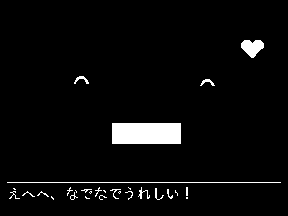
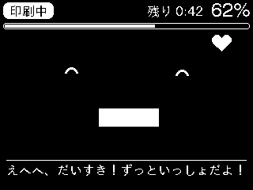
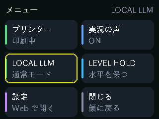
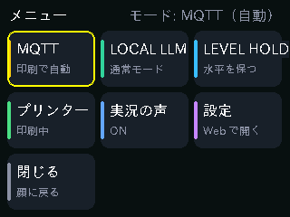
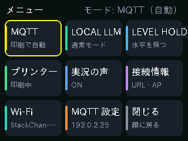
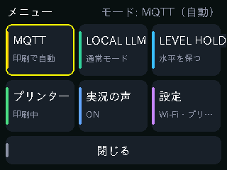
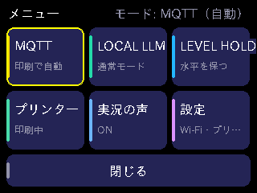

# リリース別スクリーンショット

## スタックチャン本体の画面再現イメージ

各タグの `PrinterScreen.cpp`、`main.cpp` のメニュー描画、`TouchKeyboard.cpp` をPC上で実行し、
M5GFXの実際の描画処理と内蔵フォントで320×240の画像を生成しています。
**実機から取得したスクリーンショットや写真ではなく、描画コードによる再現イメージです。**
印刷状況・ネットワーク名・入力値はサンプルです。古いファームを実機へ書き込む操作は行っていません。

### 日本語字幕（v2.5.1）

| 通常の顔画面 | MQTTの顔画面 |
| --- | --- |
|  |  |

タグのFaceHudとm5stack-avatar 0.10.0の顔パーツを実行した画面再現イメージです。
日本語フォントはlgfxJapanGothicP_16、顔スプライトは実機と同じ1bitです。
固定サンプルは笑顔・口開度0.35・呼吸位相0、MQTT側は進捗62%・残り42分。
[生成記録](v2.5.1/caption-capture.json)にソースと画像のハッシュを記録しています。
実機から取得した写真ではありません。

### メニューの変化

| v2.0.0：2列のメニュー | v2.1.0：MQTTモード追加 |
| --- | --- |
|  |  |
| **v2.2.0：本体から接続設定** | **v2.3.1：設定をまとめ、閉じるを横長に** |
|  |  |

**v2.4.0 / v2.4.1：8bit化に合わせた配色**



### 全リリースの本体画面

| リリース | プリンター詳細 | メニュー | キーボード | 生成記録 |
| --- | --- | --- | --- | --- |
| v2.5.1 | [画像](v2.5.1/device-printer.png) | [画像](v2.5.1/device-menu.png) | [画像](v2.5.1/device-keyboard.png) | [記録](v2.5.1/device-capture.json) |
| v2.5.0 | [画像](v2.5.0/device-printer.png) | [画像](v2.5.0/device-menu.png) | [画像](v2.5.0/device-keyboard.png) | [記録](v2.5.0/device-capture.json) |
| v2.4.1 | [画像](v2.4.1/device-printer.png) | [画像](v2.4.1/device-menu.png) | [画像](v2.4.1/device-keyboard.png) | [記録](v2.4.1/device-capture.json) |
| v2.4.0 | [画像](v2.4.0/device-printer.png) | [画像](v2.4.0/device-menu.png) | [画像](v2.4.0/device-keyboard.png) | [記録](v2.4.0/device-capture.json) |
| v2.3.2 | [画像](v2.3.2/device-printer.png) | [画像](v2.3.2/device-menu.png) | [画像](v2.3.2/device-keyboard.png) | [記録](v2.3.2/device-capture.json) |
| v2.3.1 | [画像](v2.3.1/device-printer.png) | [画像](v2.3.1/device-menu.png) | [画像](v2.3.1/device-keyboard.png) | [記録](v2.3.1/device-capture.json) |
| v2.3.0 | [画像](v2.3.0/device-printer.png) | [画像](v2.3.0/device-menu.png) | [画像](v2.3.0/device-keyboard.png) | [記録](v2.3.0/device-capture.json) |
| v2.2.0 | [画像](v2.2.0/device-printer.png) | [画像](v2.2.0/device-menu.png) | [画像](v2.2.0/device-keyboard.png) | [記録](v2.2.0/device-capture.json) |
| v2.1.0 | [画像](v2.1.0/device-printer.png) | [画像](v2.1.0/device-menu.png) | 未搭載 | [記録](v2.1.0/device-capture.json) |
| v2.0.0 | [画像](v2.0.0/device-printer.png) | [画像](v2.0.0/device-menu.png) | 未搭載 | [記録](v2.0.0/device-capture.json) |

表示が同じ版もあります。メニューはv2.2.0/v2.3.0、v2.3.1/v2.3.2、v2.4.0/v2.4.1/v2.5.0/v2.5.1がそれぞれ同一です。
プリンター詳細はv2.0.0〜v2.3.2、v2.4.0〜v2.5.1の各グループで同一です。
音声やサーボの修正など、静止画に現れない変更もあります。
v2.5.0の撫でる反応も動き・発話が中心で、この3画面には現れません。

## Web ダッシュボード

各リリースタグの `src/WebPages.h` から Web ダッシュボードの HTML・CSS を取り出し、
Chrome で PC 幅（1040px）とスマートフォン幅（430px）の全ページを撮影しました。
表示する印刷状況は共通のサンプルデータです（62%、残り42分、155/250層）。
接続状態・ジョブ名・温度・AMS・実況ログもサンプルで、実機の通信や保存設定は使いません。

画像を開くと原寸で確認できます。

| リリース | PC | スマートフォン | 撮影元 |
| --- | --- | --- | --- |
| [v2.5.1](https://github.com/Xenoah/stackchan-mqtt/releases/tag/v2.5.1) | [画像](v2.5.1/web-desktop.png) | [画像](v2.5.1/web-mobile.png) | [記録](v2.5.1/web-capture.json) |
| [v2.5.0](https://github.com/Xenoah/stackchan-mqtt/releases/tag/v2.5.0) | [画像](v2.5.0/web-desktop.png) | [画像](v2.5.0/web-mobile.png) | [記録](v2.5.0/web-capture.json) |
| [v2.4.1](https://github.com/Xenoah/stackchan-mqtt/releases/tag/v2.4.1) | [画像](v2.4.1/web-desktop.png) | [画像](v2.4.1/web-mobile.png) | [記録](v2.4.1/web-capture.json) |
| [v2.4.0](https://github.com/Xenoah/stackchan-mqtt/releases/tag/v2.4.0) | [画像](v2.4.0/web-desktop.png) | [画像](v2.4.0/web-mobile.png) | [記録](v2.4.0/web-capture.json) |
| [v2.3.2](https://github.com/Xenoah/stackchan-mqtt/releases/tag/v2.3.2) | [画像](v2.3.2/web-desktop.png) | [画像](v2.3.2/web-mobile.png) | [記録](v2.3.2/web-capture.json) |
| [v2.3.1](https://github.com/Xenoah/stackchan-mqtt/releases/tag/v2.3.1) | [画像](v2.3.1/web-desktop.png) | [画像](v2.3.1/web-mobile.png) | [記録](v2.3.1/web-capture.json) |
| [v2.3.0](https://github.com/Xenoah/stackchan-mqtt/releases/tag/v2.3.0) | [画像](v2.3.0/web-desktop.png) | [画像](v2.3.0/web-mobile.png) | [記録](v2.3.0/web-capture.json) |
| [v2.2.0](https://github.com/Xenoah/stackchan-mqtt/releases/tag/v2.2.0) | [画像](v2.2.0/web-desktop.png) | [画像](v2.2.0/web-mobile.png) | [記録](v2.2.0/web-capture.json) |
| [v2.1.0](https://github.com/Xenoah/stackchan-mqtt/releases/tag/v2.1.0) | [画像](v2.1.0/web-desktop.png) | [画像](v2.1.0/web-mobile.png) | [記録](v2.1.0/web-capture.json) |
| [v2.0.0](https://github.com/Xenoah/stackchan-mqtt/releases/tag/v2.0.0) | [画像](v2.0.0/web-desktop.png) | [画像](v2.0.0/web-mobile.png) | [記録](v2.0.0/web-capture.json) |

v2.1.0 以降の Web ダッシュボードのソースは共通です。各タグから個別に撮影していますが、
同じサンプルデータでは同じ画面になります。v2.0.0 にはモード表示・切り替えボタンがありません。

## Web画面の再撮影

Python 3、Node.js 22 以降、Chrome または Chromium が必要です。
リポジトリのルートで実行します。実機への書込みは不要です。

```powershell
git fetch --tags
python tools/screenshots/capture_web.py                  # 全10リリース
python tools/screenshots/capture_web.py --version v2.5.1 # 指定した版だけ
```

ブラウザを検出できない場合は `--browser "ブラウザの実行ファイルのパス"` を追加します。
撮影用サーバーは `127.0.0.1` だけで待ち受け、ブラウザは `.pio/screenshots/chrome-profile` の
専用プロファイルを使います。撮影終了時にサーバーとブラウザを終了します。

撮影時だけアニメーションを止め、進捗リング・バーの描画完了、画面幅、横方向のはみ出しを
確認してから PNG を保存します。タグの HTML・CSS ファイル自体は変更しません。
各 `web-capture.json` にタグのコミット、ソースと画像の SHA256、寸法、サンプルデータを記録しています。
フォントやブラウザのバージョンによって細部が変わることがあります。

## 本体画面の再生成（Windows）

Python 3、Pillow、ziglang、PlatformIOが取得したM5GFX依存ライブラリを使います。
今回の生成ではM5GFX 0.2.30を全版で共通使用しています。
次の公式アーカイブを `.pio/screenshots/sdl` に展開してください。

- [SDL2-devel-2.32.10-mingw.zip](https://github.com/libsdl-org/SDL/releases/download/release-2.32.10/SDL2-devel-2.32.10-mingw.zip)
- SHA256: `f15cff5fca62ec9381a016ef1d42a95c638cd72d2f226ba5781c76fe43dbd1ac`

```powershell
python -m pip install Pillow ziglang
git fetch --tags
python tools/screenshots/capture_device.py                  # 全10リリース
python tools/screenshots/capture_device.py --version v2.5.1 # 指定した版だけ
```

描画関数・メニュー配置・配色・キーボードのレイアウトはタグから取り出します。
キャンバスの色深度もタグに合わせ、v2.3.2までは16bit、v2.4.0以降は8bitです。
実機の入出力だけをホスト用に置き換え、LCDへの転送の代わりにフレームバッファをPNGへ保存します。
時刻は14:42に固定し、Wi-Fi名やIPはデモ値を使います。画面の端で切れる文字も元の描画結果を保持しています。

各 `device-capture.json` にタグのコミット、入力ソースのSHA256、描画ライブラリ、色深度、
画像の寸法とSHA256を記録しています。コンパイル中間ファイルは `.pio/screenshots/native` に保存します。


日本語字幕と顔の再現・表示期限の確認は、同じ環境で次を実行します。

```powershell
python tools/screenshots/capture_captions.py                  # 作業ツリーの検証とプレビュー
python tools/screenshots/capture_captions.py --version v2.5.1 # タグから再生成
```

顔のパーツ描画・配置・字幕処理は実際のコードを使い、時刻と入出力をホスト用に置き換えます。
字幕だけの表示、発話中の保持、終了後の消去、MQTT情報との同時表示も確認します。
